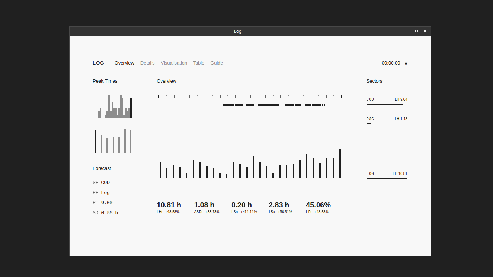

**Log** is a simple log and time-tracker available for Linux, macOS, and Windows. Download it [here](https://joshavanier.itch.io/log).

### Features

- Write log entries
- Log data visualisations and statistics

### Commands
To use the console, simply type.

- `import` - Import existing log data
- `export` - Export log data
- `start "Sector" "Project" "Description"` - Start a log entry (alt: `begin`)
- `stop` - Stop a log entry (alt: `end`)
- `pause` - Pause a log session
- `continue` - Continue the last log session (alt: `resume`)
- `edit {ID} {attribute} "Lorem ipsum"` - Edit an entry's attributes
- `set bg #fff` - Set the interface's background colour
- `set colour red` - Set the interface's text colour
- `set accent blue` - Set the interface's accent colour
- `set sector "Sector Name" {colour}` - Set a colour code for your sector
- `set project "Project Name" {colour}` - Set a colour code for your project
- `set colourmode {sector/project}` - Set colour mode (colour code the charts by sector or project)
- `set view x` - View only data from the past x days
- `set calendar gregorian` - Set to use a certain calendar system: Gregorian, [Desamber](http://wiki.xxiivv.com/#Desamber), [MONOCAL](https://monochromatic.co/writing/monocal-20), [Aequirys](https://joshavanier.github.io/aequirys)
- `set time 24` - Set the time format to 12- or 24-hours
-  `rename {sector/project} "Old Name" "New Name"` - Rename a sector or project. This will update all entries that are filed under that sector or project

### To-do
- Create an app icon
- Add ability to sort table columns
- Pomodoro timer

### Development

```
npm install
npm start
```

---

Josh Avanier

[](https://twitter.com/joshavanier) [](https://joshavanier.com)
